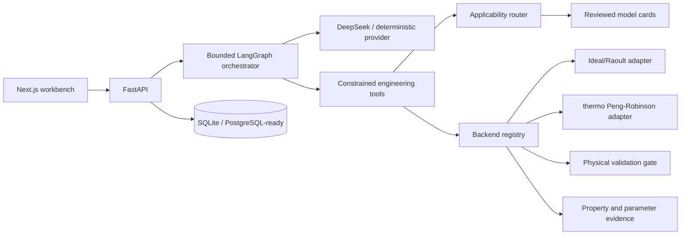

# ThermoEqui-Agent

面向工程相平衡问题的知识问答、模型选择、参数管理、确定性求解、物理校验和结果解释一体化工作台。

> A conversational agent for knowledge-grounded and physically verified engineering
> phase-equilibrium modeling.

新成员可先阅读[工程目录与文件说明](docs/repository-guide.zh-CN.md)；团队开发规则见
[CONTRIBUTING.md](CONTRIBUTING.md)、[团队分工与交付规范](docs/team-responsibilities.zh-CN.md)和
[GitHub 团队协作设置](docs/github-collaboration.zh-CN.md)。

ThermoEqui-Agent 不是让大模型“心算”相平衡。LLM 只负责语义、编排和解释；所有泡点、露点、相组成、
Flash 和曲线数据均来自可脱离 LLM 独立运行的 `thermo_engine`，并经过独立验证器。

## 当前能力

- 二元等压 T-x-y、等温 P-x-y、泡点、露点、TP Flash、共沸候选搜索和基础相态分类。
- Ideal/Raoult 内部后端与基于 `thermo` 的 Peng–Robinson 可运行后端；Wilson、NRTL、UNIQUAC
  当前保留模型卡和类型化集成契约。
- 参数缺失硬失败；参数方向、来源、形式、单位和适用域可追溯；测试参数禁止写入生产库。
- 中文确定性 Agent：任务解析、常压规范化、多轮条件修正、知识问答和超范围拒绝。
- FastAPI/OpenAPI、统一错误、request ID、SQLite 运行快照、JSON/CSV 导出。
- Next.js 工程工作台：对话、任务编辑、Plotly 相图、数据表、模型评分、物性来源、验证与历史运行。
- 无 API Key 可完整运行确定性计算和离线演示。

当前版本只支持非电解质分子体系。电解质、反应平衡、SLE、聚合物、水合物、石油假组分、多晶型、
VLLE 和完整精馏塔设计会被明确拒绝。NRTL/UNIQUAC 二元 LLE 当前只有类型化接口和硬路由规则，生产
求解器列入 Phase 4，不会用假参数替代。

## 架构



Agent 与确定性热力学框架的集成边界、模型状态矩阵和扩展方式见
[docs/integrations.md](docs/integrations.md)。

核心入口可在无前端、无 API、无 LLM 时直接调用：

```python
from thermo_engine import calculate_equilibrium, validate_equilibrium_result

result = calculate_equilibrium(task_manifest)
validation = validate_equilibrium_result(result)
```

## 本地开发

要求 Python 3.11+、Node.js 20.9+ 和 pnpm 11。

```bash
python -m pip install -e ".[dev]"
python -m uvicorn apps.api.main:app --reload --port 8000
```

另一个终端：

```bash
pnpm --dir apps/web install --frozen-lockfile
pnpm --dir apps/web dev
```

访问 `http://localhost:3000`；OpenAPI 位于 `http://localhost:8000/docs`。

## Docker 一键运行

```bash
copy .env.example .env
docker compose up --build
```

Windows PowerShell 也可使用 `Copy-Item .env.example .env`。SQLite 文件保存在命名卷中。当前开发机未安装
Docker，因此 Compose/Dockerfile 已完成静态配置，但本次交付无法在该主机执行容器烟雾测试。

## LLM 与确定性模式

默认 `.env.example` 使用：

```text
LLM_PROVIDER=deterministic
OPENAI_API_KEY=
```

该模式不访问外部模型，知识问答、任务解析、表单计算和多轮改压均可演示。

启用 DeepSeek（PowerShell）：

```powershell
$env:LLM_PROVIDER="deepseek"
$env:DEEPSEEK_API_KEY="<your DeepSeek API key>"
$env:DEEPSEEK_MODEL="deepseek-v4-flash"
$env:DEEPSEEK_BASE_URL="https://api.deepseek.com"
python -m uvicorn apps.api.main:app --reload --port 8000
```

DeepSeek 调用集中在 `agent/providers.py`，使用官方兼容的
`POST https://api.deepseek.com/chat/completions`。API Key 只从环境变量读取，不写入仓库、日志或前端。
当前默认模型使用 `deepseek-v4-flash`；`deepseek-chat` 和 `deepseek-reasoner` 是即将停用的兼容别名。
启动后访问 `http://localhost:8000/health`，确认 `llm_provider` 为 `DeepSeekProvider`。认证、余额或限流
错误会返回脱敏的 `502 external_llm_provider_error`，不会把 Key 或上游响应正文返回前端。

启用 OpenAI：

```text
LLM_PROVIDER=openai
OPENAI_API_KEY=
OPENAI_MODEL=gpt-5-mini
```

所有外部模型调用都集中在 `agent/providers.py`。若配置 `openai` 或 `deepseek` 但对应 Key 为空，
系统会安全回退到确定性 Provider；Key 不写日志、不返回前端。无论选择哪个 Provider，热力学数值
始终来自 `thermo_engine`。

## 测试与静态检查

```bash
python -m pytest
python -m ruff check agent apps/api database schemas thermo_engine tests evals
python -m ruff format --check agent apps/api database schemas thermo_engine tests evals
python -m mypy agent apps database schemas thermo_engine
pnpm --dir apps/web test
pnpm --dir apps/web lint
pnpm --dir apps/web build
```

测试覆盖公开 Python API、热力学不变量、参数安全、多轮 Agent、HTTP/OpenAPI、前端对话、图表、错误、
条件重算和导出入口。CI 位于 `.github/workflows/ci.yml`。

## CLI 演示

```bash
python -m thermo_engine.cli examples/benzene_toluene_isobaric.json --output run.json
```

示例在 101.325 kPa 下计算苯–甲苯 Ideal/Raoult T-x-y。Antoine 常数来自 NIST Chemistry WebBook：
[Benzene](https://webbook.nist.gov/cgi/cbook.cgi?ID=C71432&Mask=4) 与
[Toluene](https://webbook.nist.gov/cgi/cbook.cgi?ID=C108883&Mask=4)。相关温区写入来源记录；曲线端点超出
某条关联式温区时，验证状态为 warning，而不是静默外推或伪称工程验证通过。

## API 摘要

- 对话与解析：`POST /api/chat`、`POST /api/tasks/parse`
- 模型与参数：`GET /api/models`、`POST /api/models/recommend`、参数写入/查询
- 计算：泡点、露点、等压/等温 VLE、TP Flash、共沸和 LLE 合同端点
- 验证与追溯：`POST /api/validation`、运行查询、JSON/CSV 导出
- 运维：`GET /health`

完整契约由 `/docs` 自动生成，说明见 [docs/api.md](docs/api.md)。

## 已知限制

- 当前可执行 Backend 为低压基线 Ideal/Raoult 与 Peng–Robinson；Wilson、NRTL、UNIQUAC
  仍是合同层，不会执行或生成假参数。
- Ideal/Raoult 的本地纯物性注册表当前仅审定苯和甲苯；Peng–Robinson 组分由 `thermo`
  解析，但每个二元对都必须有 ChemSep PR `kij`，否则返回 `missing_parameters`。
- 独立验证器尚未把完整 tangent-plane-distance 证据建模为可通过检查，因此 Flash
  结果会保留相稳定性警告。
- Antoine 关联式不是实验数据集；演示验证的是计算闭环和物理约束，不代表工业设计验证。
- OpenAI Provider 需要联网和有效 Key；确定性计算不需要。
- PostgreSQL 采用 SQLAlchemy 兼容设计，部署时仍需安装所选数据库驱动并建立正式迁移流程。

路线图见 [docs/roadmap.md](docs/roadmap.md)，架构决策与状态见 [PLANS.md](PLANS.md)。
