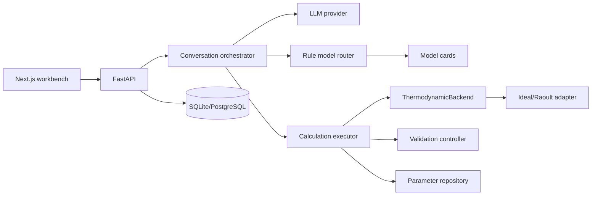

# Architecture

Only the deterministic backend emits thermodynamic numbers. API, agent, and UI exchange Pydantic
contracts and immutable run snapshots. Third-party engines can be added behind the backend protocol
without leaking their internal object model into the service layer.
